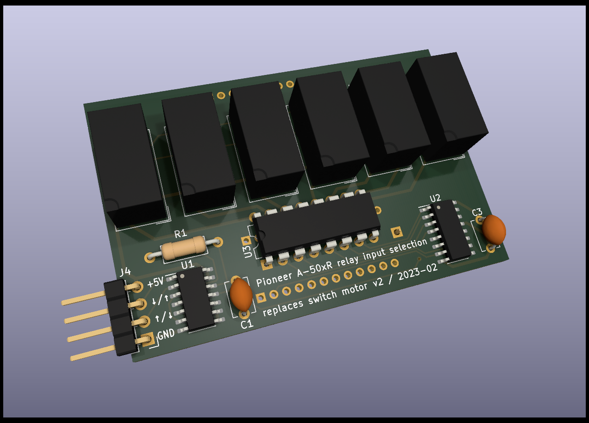
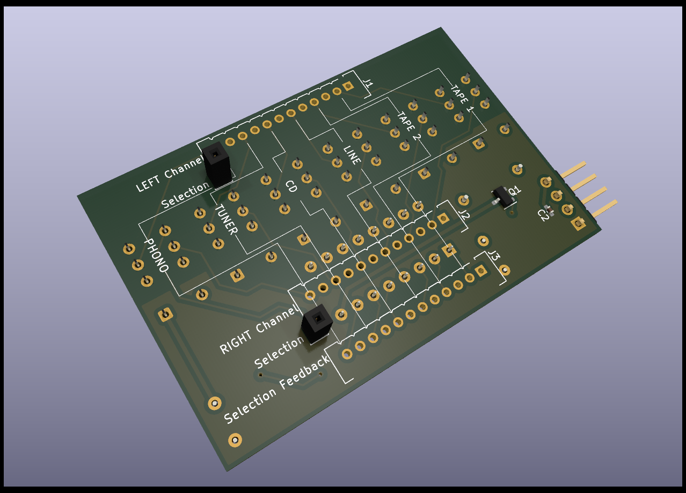

# alps-relayed
Input selection circuit board replacing the Alps ASD-1015 motor switch (and possibly others) in Pioneer's A-50xR amplifiers (and possibly others), using fast relays. The switching circuit supports the amplifier's native remote control and is faster than the motor switch (typically 42 milliseconds on average).

## Supported amplifiers
This circuit board is designed to replace ASD-1025 in the Pioneer A-502R, A-502R-G, A-503R, and A-503R-G amplifier models. Since the ASD-1025 was also used in A-602R, it may be possible to use it in this model as well, but this has not been verified.

## Versions
There are two versions of the replacement board: v1 and v2.
v1 is larger, connects to the motor pin holes via individual connectors, and includes a direct plug connector to the motor driver IC pin holes and an additional stabilizing blind plug connector.
v2 is more compact, uses only three broad connectors to the motor pin holes, and does not directly plug into the motor driver IC pin holes, but uses a patch wire connector instead.
The two versions also slightly differ in their circuitry.

## Installation

### v1 Installation
To install the v1 replacement board,
1. uninstall (unsolder) from the amplifier's input assembly board
   - the switch motor,
   - the motor driver IC (TA7291S), and
   - the nearby tall electrolytic capacitor (labelled C293),
2. solder simple vertical pin headers (e.g. Samtek TSW-1xx) into the input assembly board as follows:
   - a single-row 9-pin header strip where the motor driver IC was,
   - a single pin in each of the now-free motor's drill holes that would be connected by the replacement board (20 in total), and
   - a single pin in the free drill hole that would be connected by the replacement board's single corner socket, right next to the ribbon cable socket,
3. plug the replacement board on the input assembly board, aligning the selection board's new pins with the replacement board's sockets.

### v2 Installation
To install the v2 replacement board,
1. uninstall (unsolder) from the amplifier's input assembly board
   - the switch motor, and
   - the motor driver IC (TA7291S),
2. solder a single-row 9-pin header strip (e.g. Samtek TSW-1xx) to replace the motor driver IC,
3. from three Hirose DF3A-12P-2DSA pin headers, clip off every other pin (the odd-numbered pins) and solder them into the upper rows of the three double-row motor drill holes (pay attention to orientation),
4. stick a plain pin (min. 7mm) in each of the replacement board's two "Selection" sockets,
5. plug the replacement board on the input assembly board (the two plain pins extending from the replacement board should go through pin holes the on input assembly board),
6. use four individual jumper wires to connect the replacement board's +5V, GND, ↑, and ↓ pins to four of the motor driver IC's replacement header strip's pins (counted from left to right, starting at 1) as follows:
   - +5V connects to pin number 4,
   - GND connects to pin number 5,
   - ↑ and ↓ connect to pins number 1 and 9 in any order.
