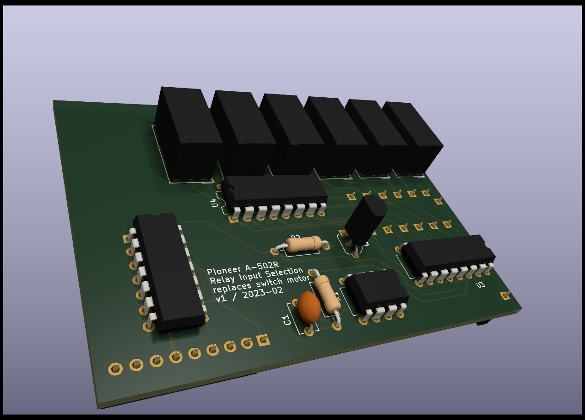
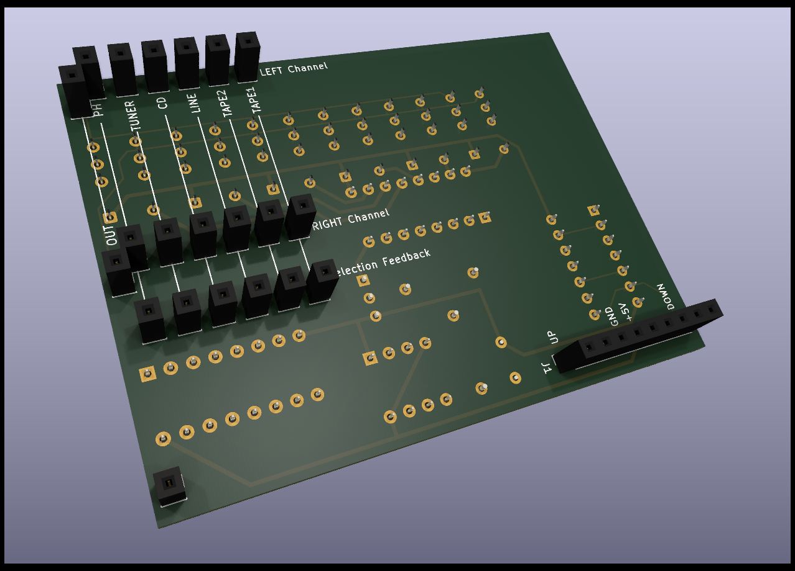

# asd1025-relayed
Input selection circuit replacing the ASD-1015 motor switch in Pioneer's A-50xR amplifiers, using relays.

## Supported amplifiers
This circuit board is designed to replace ASD-1025 in the Pioneer A-502R, A-502R-G, A-503R, and A-503R-G amplifier models. Since the ASD-1025 was also used in A-602R, it may be possible to use it in this model as well, but this has not been verified.

## Installation
To install the replacement board,
1. uninstall (unsolder) from the amplifier's input selection circuit board
   - the switch motor,
   - the motor driver IC (TA7291S), and
   - the nearby tall electrolytic capacitor (labelled C293),
2. solder simple vertical pin headers (e.g. Samtek TSW-1xx) into the input selection circuit board as follows:
   - a single-row 9-pin header strip where the motor driver IC was,
   - a single pin in each of the now-free motor's drill holes that would be connected by the replacement board (20 in total), and
   - a single pin in the free drill hole that would be connected by the replacement board's single corner socket, right next to the ribbon cable socket,
3. plug the replacement board on the input selection board, aligning the selection board's new pins with the replacement board's sockets.
